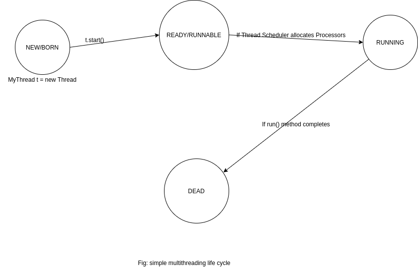
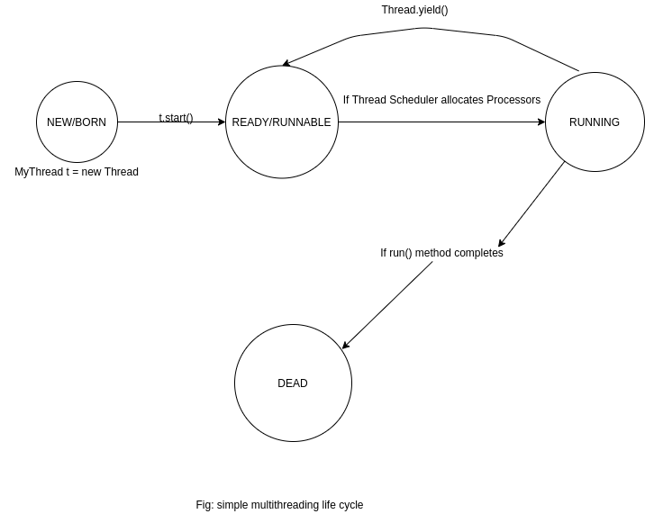
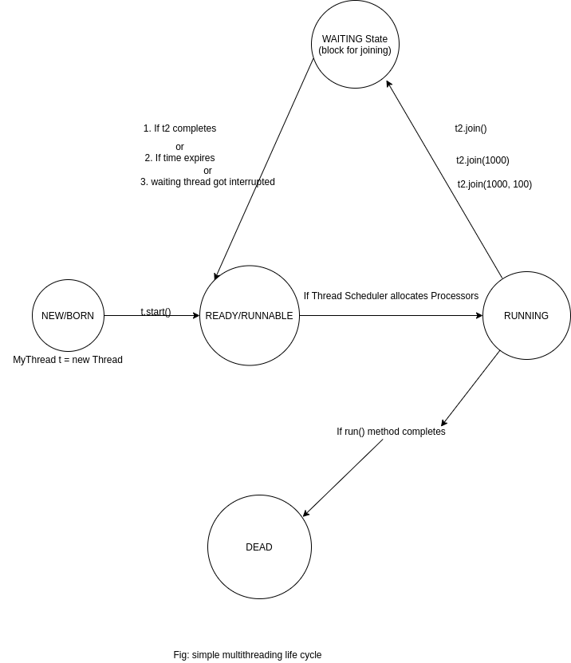
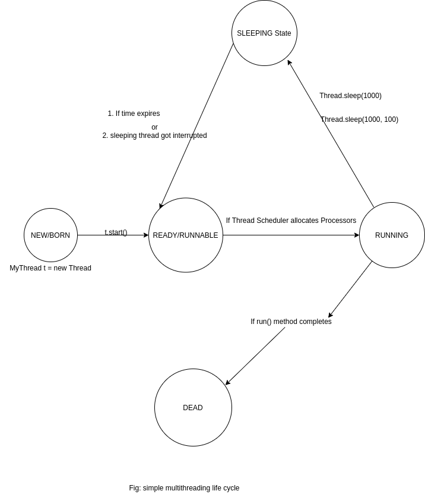
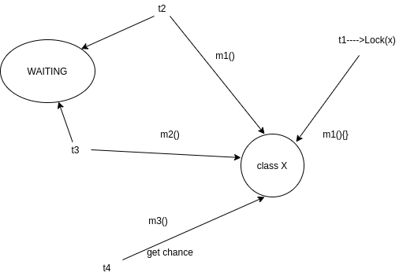
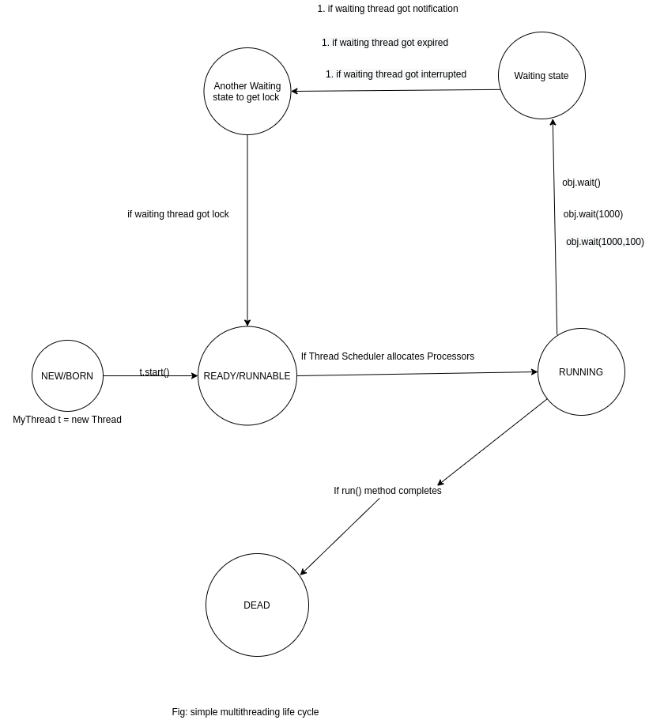
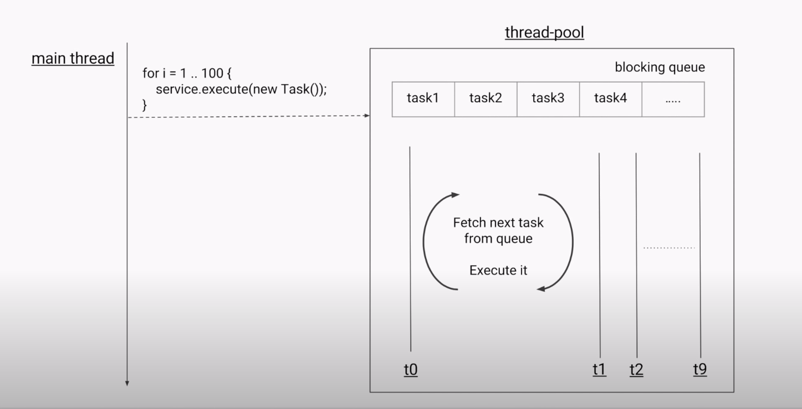
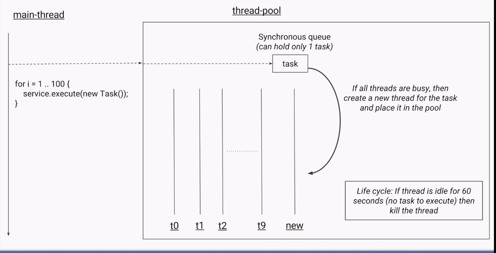
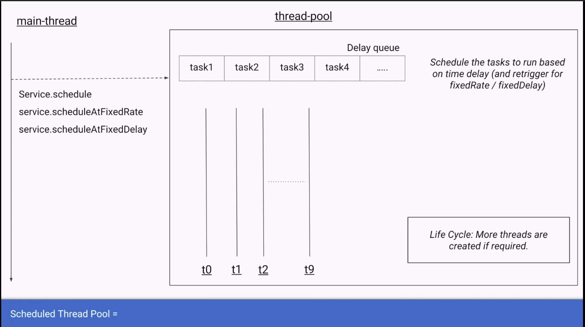
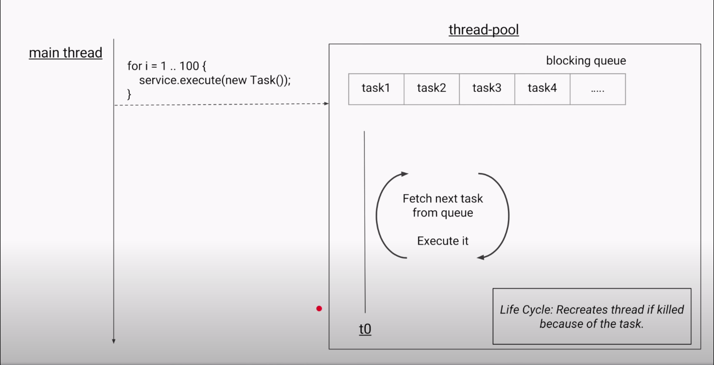

#### 1.Introduction
#### 2. The way to define thread
- by extends Thread class
- by implementing Runnable Interface
#### 3.Getting and Setting name of thread
#### 4.Thread priorities
#### 5.The method to prevent thread execution

- yield()
- join()
- sleep()
#### 6. Synchronization
#### 7. Inter Thread communication
#### 8. DeadLuck
#### 9. Deamon Threads
#### 10. Multithreading  enhancement
--------------------------------------------------

#### Multitasking: *executing multiple task simultaneously.*
- Process based:
 
Executing multiple(several) task simultaneously where each task is a separate independent program(process)(each task running in separate
 thread, no dependencies between the task). It is based on OS level.
 
Here,the example below there are three independent programs(or may more).

Example: 
Typing a java program editor, listening audio from the same system, download a file.(no dependent between these task).

- Thread based multitasking: 

Executing multiple(several) task simultaneously where each task is a separate independent part of the same program(only one program).
Each independent part called thread. 

It is based on a programmatic level.

Here, there is only one program but may have several independent part(thread).


 #### Multi-threading: *executing multiple threads simultaneously.*
 Used to develop: 
 
 - multimedia graphics, animation, gaming, web/application server(eg. tomcat)
 
 Developing multithreaded application in java is very easy because provides inbuilt support for  multi-threading with rich
 API[Thread, Runnable, ThreadGroup..etc]
 
 #### What is Thread?
 - separate flow of execution
 - for every thread separate independent job required.
  
#### The way to define thread
- by extends Thread class
```
public class MyThread extends Thread{
    @Override
    public void run() {
        super.run();
    }
}
```
- by implementing Runnable Interface

```
public class MyThread implements Runnable {
    
    @Override
    public void run() {
    }
}
```

#### Thread Scheduler: *is a part of JVM*

It is responsible to schedule threads that is if multiple thread are waiting to get the chance of execution then which
order thread will be executed is decided by thread scheduler. We can't expect exact which algorithm followed by thread 
scheduler, it is varied from JVM to JVM. Hence, we can't execution order and exact output. Hence,whenever situation comes 
to multithreading there is no guaratee for exact output, but we can provide several possible outputs.

#### Difference between start() and run()
```
public class Main {

    public static void main(String[] args) {
        /*
          In Main Thread there is only one thread and is responsible to start() other thread. Here,
          Child thread(MyThread class) is responsible to start run() method and Main Thread is responsible to
          run this main() method code.
         */
        MyThread myThread = new MyThread(); //Thread instantiation
        myThread.start(); //starting of thread

        for (int i=0; i<10; i++){
            System.out.println("Main Thread: "+ i);
        }
    }
}
```
```
public class MyThread extends Thread{
    @Override
    public void run() {
        //job of thread
        for (int i =0; i<=10; i++){
            System.out.println("Child Thread:"+ i);
        }
    }
}

```

In the case of myThread.start(), a new thread is created which is responsible for the execution of the run() method.

In the case of myThread.run() a new thread won't to be created, and the run() method will be executed just like a
normal method call by Main Thread.

Hence, the above program if replace myThread.start() with myThread.run() then the output is same order always. 
Example: The main Thread follows the child thread.
So always use start() to run thread.

#### start() method is responsible for:
```
{
   - Register the thread with thread scheduler
   - Perform all other mandatory activities
   - Invoke run() method
}
```
Hence, without executing thread class method there is no chance of starting a new thread in Java, dut to this
the thread class start() method consider as heart of multi-threading.

#### Is Thread overloading is possible?

```
public class ThreadOverloading extends Thread {

    @Override
    public void run() {
        for (int i = 0; i <= 2; i++) {
            System.out.println("no args method:" + i);
        }
    }
    public void run(int i) {
        for (i = 0; i <= 2; i++) {
            System.out.println("args method:" + i);
        }
    }
}

class DemoThread {
    public static void main(String[] args) {
        ThreadOverloading t = new ThreadOverloading();
        t.start(); 
    }
}

output:
no args method: 1
no args method: 2 
```

Yes, thread overloading is possible but start() method always call the no-args run() method.

#### overriding the start() method

```
public class OveridingStart extends Thread {
    
    @Override
    public synchronized void start() {
        System.out.println("start method");
    }

    @Override
    public void run() {
        System.out.println("run method");
    }
}

class ThreadDemo{
    public static void main(String[] args) {
        OveridingStart ot = new OveridingStart();
        ot.start();
        System.out.println("main method");
    }
}
/*
     output:
      start method
      main method
   */
```
If we override the start() method then our start() method will be executed just like a normal method call, and a 
new thread won't be created, because the thread start() method never call Thread class start() method. It is not 
recommended to override the start() method, otherwise don't go for multithreading concept.

```
public class OveridingStart extends Thread {
    
    @Override
    public synchronized void start() {
        super.start(); //super is used
        System.out.println("start method");
    }

    @Override
    public void run() {
        System.out.println("run method");
    }
}

class ThreadDemo{
    public static void main(String[] args) {
        OveridingStart ot = new OveridingStart();
        ot.start();
        System.out.println("main method");
    }
}

but if you use super.start() , the possible output are:
/*
     output:
      start method
      run method
      main method
or 
   run method
   start method
   main method

or 
     start method
     main method
     run method
   */
```
#### Thread Life-Cycle



###
After starting a thread if your are trying to restart the same thread we will get runtime exception:
IllegalThreadStateException

```
public class IllegalThreadException extends Thread{
    @Override
    public void run() {
        //job of thread
        System.out.println("Child Thread:");
    }
}

class Demo{
    public static void main(String[] args) {
        IllegalThreadException t = new IllegalThreadException();
        t.start();
        System.out.println("Main Thread");
        t.start();//IllegalThreadStateException
    }
}
//output:
Child Thread:
Main Thread
Exception in thread "main" java.lang.IllegalThreadStateException
	at java.lang.Thread.start(Thread.java:708)
	at com.us.lot.extendsthread.Demo.main(IllegalThreadException.java:19)
```

#### Runnable
```
public class MyRunnableThread implements Runnable {

    @Override
    public void run() {
        System.out.println("Child");
    }
}

class  Demo{
    public static void main(String[] args) {
        //Runnable
        MyRunnableThread myThread = new MyRunnableThread();

        Thread t1 = new Thread(myThread);
        t1.start();
        System.out.println("hello");
    }
}
```

#### Which approach is best approach?

Among two ways of defining a thread implement runnable approach is recommended.

In the first approach(extends thread), our class always extends Thread class, there is no chance of extending any other 
class.Hence, we are missing inheritance benefit and vice versa.

##### Thread class constructor

```
new Thread()
new Thread(Runnable var1);
new Thread(Runnable var1, AccessControlContext var2) 
new Thread(ThreadGroup var1, Runnable var2) 
new Thread(String var1)
new Thread(ThreadGroup var1, String var2) 
new Thread(Runnable var1, String var2) 
new Thread(ThreadGroup var1, Runnable var2, String var3) 
new Thread(ThreadGroup var1, Runnable var2, String var3, long var4);
```

#### Thread priorities

Every thread in java has some priority it may default priority generated by JVM, or customizable priority provided by 
a programmer. The valid range of thread priority is 1 to 10, where 1 is MIN priority and 10 is MAX priority. Thread class 
defined the following constants to represents some standard priority.

```
    Thread.MIN_PRIORITY = 1;
    Thread.NORM_PRIORITY = 5;
    Thread.MAX_PRIORITY = 10;
```
Thread scheduler will use priorities while allocating the processor.

The Thread which is having the highest priority will get chance first.

If two  thread having same priority e.g 7 and 7 then we can't expect exact execution order, it depends on thread scheduler.

The Thread class defined following method to get and the set priority of the thread:
```
public final int getPriority();
public final void setPriority(int p);
```
Allowed values range 1 to 10, otherwise throw runtime exception IllegalArgumentException.

```example:
    t.setPriority(17) //throw exception
```
#### Default priority 

The default priority only for the Main thread is 5, but all the remaining thread default priority will be inherited from
parent to child i.e. what ever the Parent Thread have the same priority will be there for the Child Thread.
```
Example: 
public class ThreadPriority implements Runnable {
    @Override
    public void run() {

    }
}

class PriorityMain{

    public static void main(String[] args) {
        System.out.println("default priority main thread: "+ Thread.currentThread().getPriority());//5

        Thread.currentThread().setPriority(7);
        System.out.println("after setting parent priority: "+ Thread.currentThread().getPriority()); //7

        ThreadPriority runnable = new ThreadPriority();
        Thread thread = new Thread(runnable);

        System.out.println("Child priority: "+ thread.getPriority());//7

    }
}
```
Note: some platforms won't proper support for thread priorities. Here,even I set priority 7  which is more highest priority 
than default Main Thread priority(5)

```
Example: 
public class ThreadPriority implements Runnable {
    @Override
    public void run() {

    }
}

class PriorityMain{

    public static void main(String[] args) {
        System.out.println("default priority main thread: "+ Thread.currentThread().getPriority());

        Thread.currentThread().setPriority(7);
        System.out.println("after setting parent priority: "+ Thread.currentThread().getPriority());

        ThreadPriority runnable = new ThreadPriority();
        Thread thread = new Thread(runnable);

        System.out.println("Child priority: "+ thread.getPriority());

    }
}
```

#### Prevent Thread execution:

we can prevent a thread execution by using the following methods:
- yield()
- join()
- sleep()

##### yield():

- yield() method causes to pausing current executing thread to give the chance for waiting threads of same priority.

- If there is no waiting threads or all waiting thread have low priority then same thread can continue its execution.

- If multiple threads(t1,t2,t3,t4) are waiting with same priority(e.g 7) then which waiting thread will get the chance 
we can't expect it depends on thread scheduler.

- The thread which is yielded(e.g t1), it will get the chance once again it depends on thread scheduler and, we can't 
expect exactly.
```
public static native void yield()
```

```
Example:
public class YieldExpThread extends Thread {
    @Override
    public void run() {
        for (int i = 0; i <= 10; i++) {
            System.out.println("Child thread");
            Thread.yield(); ----------(I)
        }
    }
}

class Demo {

    public static void main(String[] args) {
        YieldExpThread t = new YieldExpThread();
        t.start();

        for (int i = 0; i <= 10; i++) {
            System.out.println("Main thread");
        }

    }
}
```
In the above program, if we are commenting line(I) then both thread will be executed simultaneously and, we can't expect 
which thread will complete first.

If we are not commenting line then child thread always called yield() method because of that main thread will get a chance
more number of times, and the chance of completing main thread first is high.

Note: Some platform won't provide proper support for yield() method.


##### join()

If a thread wants to wait until completing some other thread then we should go for join() method.

For example: if a thread t1 wants to wait until completing t2 then t1 has to call  t2.join().

If t1 executes t2.join() then immediately t1 will be entered into waiting state until t2  completes.Once a t2 complete then
t1 can continue its execution.
```
 public final void join() throws InterruptedException;
public final synchronized void join(long ms) throws InterruptedException;
public final synchronized void join(long ms, int ns) throws InterruptedException;
```


```
public class JoinExpThread extends Thread {
    @Override
    public void run() {
        for (int i = 0; i <=10 ; i++){
            System.out.println("Child thread");
            try{
                Thread.sleep(2000);
            }catch (InterruptedException ex){
                System.out.println(ex.getMessage());
            }
        }
    }
}

class TestDemo{
    public static void main(String[] args) throws InterruptedException {
        JoinExpThread t = new JoinExpThread();
        t.start();
        //main thread running
        t.join(); ///main thread is completed until child thread is complted

        for (int i = 0; i <=10 ; i++){
            System.out.println("Main thread");
        }
    }

    /*output:
     * Child thread
Child thread
Child thread
..........
Main thread
Main thread
..........
     */
}
```
**Deadlock cases with join() method:**

The below example,if the main thread calls join() method on child thread object and child thread call join() method on 
main thread object then both the thread will wait forever, and the program will be pause(stuck).
```Example1:
public class StaticJoinExpThread extends Thread {

    static Thread mt; //mt = main thread reference

    @Override
    public void run() {
        try {
            mt.join(); //child thread waiting to complete main thread
        } catch (InterruptedException e) {
            e.printStackTrace();
        }
        for (int i = 1; i<=10; i++){
            System.out.println("Child thread");
        }
    }
}

class ThreadJoinDemo{

    public static void main(String[] args) throws InterruptedException {
        StaticJoinExpThread.mt = Thread.currentThread(); //mt point into main thread i.e mt assign Main Thread

        StaticJoinExpThread t = new StaticJoinExpThread();
        t.start();
        t.join(); //here, main thread is waiting until child thread is completed, this cause dead lock because child thread main thread  both call join method and wait until completed each. so don't call join() method both in child and main thread
        for (int i = 1; i<=10; i++){
            System.out.println("main thread");
            Thread.sleep(2000);
        }
    }
}
 output: nothing

```
The below example, if a thread calls join() method on the same thread itself then the program will stucked(paused). In this
case thread has to wait infinite amount of time.

```
Example 2:
class ThreadJoinDemo{
   
       public static void main(String[] args) throws InterruptedException {
           Thread.currentThread().join();
  }
}
 output: nothing
```
##### sleep()

If your thread don't want to perform any operation for a particular amount of time then we should go for sleep() method.
```
    public static native void sleep(long ms) throws InterruptedException;
    public static void sleep(long ms, int ns) throws InterruptedException;
```


```
class SlideRotatorSleepExp{

    public static void main(String[] args) throws InterruptedException {
        for (int i=1; i<=10; i++){
            System.out.println("Slide-" +i);
            Thread.sleep(5000);
        }
    }
}
```
A Thread can interrupt the sleeping thread or waiting thread by using interrupt()  method of thread class;
```
public void interrupt();
```

**How a thread can interrupt another thread**
```
public class InterruptSleepThread extends Thread {
    @Override
    public void run() {

        try {
            for (int i = 1; i <= 10; i++) {
                System.out.println("I am lazy thread");
                Thread.sleep(2000);
            }
        } catch (InterruptedException e) {
            System.out.println("I got interrupted");
        }
    }
}

class ThreadInterruptedDemo {
    public static void main(String[] args) {
        InterruptSleepThread t = new InterruptSleepThread();
        t.start();

        t.interrupt(); //main thread interrupt the child thread-----(I)
        System.out.println("End of main thread");
    }
}//output:
End of main thread
I am lazy thread
I got interrupted

```
In above program, if you comment line(I) the main thread won't interrupt child thread.In this case the child thread execute
for loop  10 times.

Note:
- Whenever we are calling interrupt() method if the target thread not in sleeping/waiting state then there is no impact of
interrupt() call immediately. inturrupt() call will be waiting until target thread enter into sleeping or waiting thread.

-If the target thread sleeping or waiting state then immediately interrupt call will interrupt the target thread.

- If the target thread never enter into sleeping or waiting state in its life-time then there is no impact of interrupt() 
call. This is the only case where interrupt() call will be waisted.
```
public class InterruptThread  extends Thread{
    @Override
    public void run() {
        for (int i = 1; i<10000; i++){
            System.out.println("I'm lazy thread: "+i);
        }
        System.out.println("I want to sleep");

        try {
            Thread.sleep(10000);
        } catch (InterruptedException e) {
            System.out.println("I got interrupted");
        }
    }
}

class ThreadDemo{
    public static void main(String[] args) {
        InterruptThread t = new InterruptThread();
        t.start();

        t.interrupt();
        System.out.println("end of main");
    }
}
```

|S.N| property |yield() | join() | sleep|
|----|------| ------| ------|--------|
|1 |purpose?|if a thread wants to pause its execution to give the chance for remaining thread of same priority then we should go for yield()|If a thread wants to wait until completing some other thread then we should go for join()|If the thread don't want to perform any operation for a particular amount of time then we should go for sleep()|
|2|it is overloaded?|no|yes|yes
|3|it is final?|no|yes|No
|4|it is throw IE?|no|yes|yes
|5|it is native?|yes|no|sleep(long ms)--->native, sleep(long ms, int ns)----> no native
|5|it is static?|yes|no|yes


### Synchronization

Synchronizer is the modifier applicable only for method on blocks but not for classes and variables.

If multiple threads are trying to operate on the same java object then there may be a chance of data inconsistency problem.
To overcome this problem should go for synchronizer keyword.

If a method are block declared as a synchronizer then at a time only one thread is allowed to execute that are blocked on the 
given object so that **data inconsistency** problem will be resolved. 

The main advantage of synchronizer keyword is we can resolve data inconsistency problems, but the main disadvantage of 
synchronizer keyword is it increase waiting time of thread and creates performance problems. Hence, if there is no specific
requirement then it is not recommended to use synchronizer keyword.

Internally the synchronization concept is implemented by using lock(). Every object in java has a unique lock.
Whenever we are using synchronizer keyword then only lock concept will come into the picture.

- If a thread wants to execute synchronizer method on given object first it has to get lock on that object. 
- Once the thread got the luck then it is allowed to execute any synchronizer method on that object.
- Once the method execution complete automatically thread releases the lock.
- Accquiring and releasing the lock internally takes care by JVM and the programmer not responsible this activity.

While a thread executing synchronizer method on the given object the remaining threads are not allowed to execute any synchronizer
method simultaneously, but the remaining threads are allowed to execute non-synchronization method simultaneously.

```
class X{
     synchronized m1();
     synchronized m2();
     m3();
}
```


- Lock concept is implemented based on Object but not based on method.

**Every object in jav there are two areas**: *synchronize area and non-synchronize area*

- **Synchronize** area can be accessed by only one thread at a time
- **non-Synchronize** area can be accessed by any number of thread simultaneously.
```
class X {
   sync{
    whereever  we are performing  update operation(ADD/REMOVE/DELETE/REPLACE)
   i.e where state of object changing
  }
  non-sync{
     where ever state of object won't changed like read() operation
}
}
```
````
public class Display {

    public synchronized void wish(String name){
        for (int i=1; i<=5; i++){
            System.out.println("Good morning!!");
            try {
                Thread.sleep(1000);
            }catch (InterruptedException ex){
                ex.printStackTrace();
            }
            System.out.println(name);
        }
    }
}

class MyThread extends Thread{
        Display d;
        String name;

        public MyThread(Display d, String  name){
            this.d = d;
            this.name = name;
        }

    @Override
    public void run() {
        d.wish(name);
    }
}

class SynchronizeDemo{
    public static void main(String[] args) {
        Display d = new Display();
        MyThread t = new MyThread(d, "chandra");
        MyThread t2 = new MyThread(d, "hari");
        MyThread t3 = new MyThread(d, "john");
        MyThread t4 = new MyThread(d, "dhoni");
        t.start();
        t2.start();
        t3.start();
        t4.start();
    }
}

output: regular output
````
- **Class level lock**: every class in java has an unique lock which is nothing but class level lock. If a thread wants
to execute *static synchronized* method, then thread require class level lock. Once a thread got class level then it is
allowed to execute any static synchronized method of that class.

Once a method execution complete thread releases th lock.
```
class X{
   static sync m1();
   static sync m2();
        static m3();
        sync m4();
               m5();
}
```
While a thread executing static synchronized method the remaining threads are not allowed to execute any static synchronized
simultaneously,but remaining threads are allowed to execute the following method simultaneously.
 - normal static method
 - synchronize instance method
 - normal instance method

- **Object level lock**

```
public class Displays {

    public synchronized void displayn(){
        for (int i=1; i<=10; i++){
            System.out.println(i);
            try {
                Thread.sleep(2000);
            }catch (InterruptedException ex){
                ex.printStackTrace();
            }
        }
    }

    public synchronized void displayc(){
        for (int i=65; i<=75; i++){
            System.out.println((char) i);
            try {
                Thread.sleep(2000);
            }catch (InterruptedException ex){
                ex.printStackTrace();
            }
        }
    }
}

class MyThreads extends Thread{
    Displays d;

    public MyThreads(Displays d){
        this.d = d;
    }

    @Override
    public void run() {
        d.displayn();
    }
}

class MyThreads1 extends Thread{
    Displays d;

    public MyThreads1(Displays d){
        this.d = d;
    }

    @Override
    public void run() {
        d.displayc();
    }
}

class ThreadDemo{
    public static void main(String[] args) {
        Displays d = new Displays();

        MyThreads t1 = new MyThreads(d);
        MyThreads1 t2 = new MyThreads1(d);
        t1.start();
        t2.start();
    }
}
//
1
2
...
10
A
B
..
J
K
```

#### Synchronized block and what is the advantages of synchronization block over synchronization method

If a very few lines of the code synchronization, then it is not recommended to declare entire method as synchronizer. We
have to enclose those few lines of the code by using synchronizer block.

The main advantage of synchronization block over synchronizer method is it reduces waiting time of thread and improves
performance of the system.

```
I) To get lock of current Object
class X{
..........
..........
synchronize(this){  //  if a thread got the lock of current object(this) then only it is allowed to execute this area
..........
}
..........
..........
 }

II) To get lock of particular Object 'b'
class X{
..........
..........
synchronize(b){  //  if a thread got the lock of particular object(b) then only it is allowed to execute this area
..........
}
..........
..........
 }

III) To get class level lock
class X{
...........
sync(Display.class){//if a thread got the class level lock of Display class then only it is allowed to execute this area
.............
}
......
}
```

```
example:
    public MyThread(Display d, String name){
        this.d = d;
        this.name = name;
    }

    @Override
    public void run() {
        d.wish(name);
    }
}

class SynchronizeDemo{
    public static void main(String[] args) {
        Display d = new Display();
        MyThread t1 = new MyThread(d, "Jharana");
        MyThread t2 = new MyThread(d, "Saleena");
        t1.start();
        t2.start();
    }
}
//output:
Good morning
Jharana
....
Good morning
Saleena

```

Lock concept applicable for object types and class type but not for primitives data types.Hence we can't pass primitive 
as argument in synchronized block otherwise we will get compile time error saying UnExpected type found,int required 
reference.
```
int x= 0;
synchronized(x){}
output: error
```
1. What is synchronizer keyword? where we can apply?
2. Explain advantage of synchronized keyword?
3. Explain dis-advantage of synchronized keyword?
4. What is Race Condition?

Ans: If multiple threads are operating simoultaneously on same java object  then there may be a chance of data inconsistency 
problem.This is called Race condition.

We can overcome this problem by using synchronized keyword.

5. What is Object Lock and  when it is required?
6. What is class level lock and when it is required?
7. What are the different between  class level and object level lock?
8. Is a thread acquire a multiple locks or not?

Ans: Yes of course from different objects.
```
class X{
 public synchronized void m1(){
     //here thread  has lock of  X object
     Y y = new Y();

    synchronized(y){
    //here thread  has lock of  X  and Y objects

     Z z = new Z();
     synchronized(z){
     //here thread  has lock of  X, Y, and Z objects

      ------------
     -------------
     }
   }
  }
}
X x = new X();
x.m1();
```
9. What is synchronized statement?(interviee created terminology)

The statement presents in synchronized method and synchronied block are called synchronized statement.


### Inter Thread communication:

The twi thread can communicate with each other by using: **wait(), notify() and notifyAll()**methods.

The thread which is expecting the updation is responsible for wait() method, and the thread immediatly enter into waiting state.

The thread which is responsible to perform updation after performing updation it is responsible to call notify() method,
then waiting thread will get that notification, and continue its execution with those updated items.

#### **wait(), notify() and notifyAll()**

These methods are present in Object class but not in Thread class because thread can call these methods on any java object.

To call these methods on any object, thread should be owner of that object that is, the thread should have lock of  that 
object i.e. the thread should be in synchronized block.Hence, we can call these methods only from synchronized area(block)
otherwise we will get runtime exception saying IllegalMonitorStateException.

If a thread calls wait() method on any object it immediately releases the lock of that particular object and enter into waiting
state. 

If a thread calls notify() method on any object it releases the lock of that object but may not immediately.

Except wait(), notify() and notifyAll() there is no other method where thread release the lock.

| method | is thread release the lock|
|------- |---------------|
|yield()| No|
|join()| No|
|sleep()| No|
|wait()| Yes|
|notify()| Yes|
|notifyAll()| Yes|

```
    public final native void notify();

    public final native void notifyAll();

    public final void wait() throws InterruptedException;

    public final native void wait(long ms) throws InterruptedException;

    public final void wait(long ms, int n) throws InterruptedException 
```


```
public class ThreadA {
    public static void main(String[] args) throws Exception {
        ThreadB b = new ThreadB();
        b.start();
        synchronized (b){
            System.out.println("1. Main thread calling the wait method");
            b.wait();
            System.out.println("4. Main thread got notification");
            System.out.println(b.total);

        }
    }
}

class ThreadB extends Thread{
    int total = 0;

    @Override
    public void run() {
        synchronized (this){
            System.out.println("2. child start calculation");
            for (int i=1; i<=100; i++){
                total+=i;
            }
            System.out.println("3. child thread giving notification");
            this.notify();
        }
    }
}
//output:
1. Main thread calling the wait method
2. child start calculation
3. child thread giving notification
4. Main thread got notification
5050
```

#### Producer-Consumer problem:

- Producer thread is responsible to produce items to the queue and the consumer thread is responsible to consume items from
the queue.

- If the queue is empty then consumer thread will call wait() method and enter in waiting state.
- After producing items to the queue producer thread is responsible to call notify() method then waiting consumer will get
that notification and the continue its execution with the update items.

```
class ProducerThread{
  produce(){
   synchronized(Queue q){
     produce items to the queue;
     q.notify();
  }
 }
}

class ConsumerThread{
  consume(){
   synchronized(Queue q){
     if(q is empty){
       q.wait();
     }else{
     consumes items;
    }
  }
 }
}
```

#### Difference between notify() and notifyAll()

- We can use notify() method to give the notification for only one waiting thread. If multiple threads are waiting then only
one thread will be notify() and the remaining threads have to wait for further notification.
Which thread will be notifying we can't expect it depends on JVM.

- We can use use notifyAll() method to give the notification for all waiting thread of a particular object. Even though 
multiple thread got notify the execution will perform one by one because threads are required lock and only one lock 
is available.


### Deadlock

If two threads are waiting for each other for forever such a type of infinite waiting is called deadlock. Synchronized
keyword is he only reason for deadlock situation. Hence, while using synchronization keyword we have to special care.

There is no resolvation techniques for deadlock but there are several prevention technique are available.

### Daemon Thread

- The thread which are executing in the background are called daemon thread. E.g garbage collection, attach listener, signal
dispatcher etc.

- The main objective of daemon thread is to provide support for non-daemon thread(Main Thread).
For eg. if the main thread runs with the low memory then JVM runs garbage collector(GC) to destory useless objects so that
number of bytes free memory will be improved, with these free memory the main thread can continue its execution.

- Usually, the daemon thread having low priority but based on our requirement daemon thread can run with high priority also.

```
public boolean isDaemon(); 
public void setDaemon(boolean b); 
```
we can change the daemon nature of the thread by using setDaemon() method but changing daemon nature is possible 
before starting of a thread only. After starting a thread if we are trying to change daemon nature then we will get runtime
exception saying IllegalThreadStateException.

**Default nature**: by default main thread is always non-daemon and for remaining thread daemon nature will be inherited
from parent to child. That is, if the parent thread is daemon then automatically child thread is also daemon and the parent
thread is non-daemon then child thread is also non-daemon.

- It is impossible to change daemon nature of main thread because it is already started by JVM at the beginning.
```
public class Daemon {
    public static void main(String[] args) {
        System.out.println(Thread.currentThread().isDaemon());//false
//        Thread.currentThread().setDaemon(true);// IllegalThreadStateException

        MyThread t = new MyThread();
        System.out.println(t.isDaemon());//false
        t.setDaemon(true);
        System.out.println(t.isDaemon());//true
    }
}

class MyThread extends Thread{
}
```

### Green thread

Java multithreading concept is implemented by : **green thread model and native Os model**

**Green thread model**: completly manages by JVM without taking underlying os support. Very few OS like Sun Solarist
provide support for green thread model. It is deprecated.

**native Os model**: the thread which is managed by the JVM with help of underlying OS.
All windows based OS provide support for native os model.

### how to stop thread?

- stop(),suspend(),resume() //all methods are deprecated


## Multithreading enhancement

####ThreadGroup

Based on functionality we can group thread into a single unit which is nothing but ThreadGroup i.e thrad group contains
a group of thread.

In addition to threads a thread group can also sub-thread groups.
The main advantage of maintaining thread in the form of thread group is we can perform common operation very easily.

```
Constructors:

i) ThreadGroup g = new ThreadGroup(String gName); //creates a new thread group with the specified name. The parent of this new 
group is the thread group of currently executing thread.
e.g ThreadGroup g = new ThreadGrop("Firsgroup");

ii) ThreadGroup g1 = new ThreadGroup(ThreadGroup parentGroup, String gName);
e.g ThreadGroup g1 = new ThreadGroup(g, "Secondgroup")
```
```
public class ThreadGroupExample {
    public static void main(String[] args) {
        ThreadGroup g = new ThreadGroup("first group");
        System.out.println(g.getParent().getName());

        ThreadGroup g1 = new ThreadGroup(g, "second thread");
        System.out.println(g1.getParent().getName());
    }
}
//output:
main
first group
```
```
public class MyThread {
    public static void main(String[] args) {
        ThreadGroup system = Thread.currentThread().getThreadGroup().getParent();
        Thread[] t = new Thread[system.activeCount()];
        system.enumerate(t);
        for (Thread t1: t){
            System.out.println(t1.getName() + "....."+ t1.isDaemon());
        }
    }
}
//output:
Reference Handler.....true
Finalizer.....true
Signal Dispatcher.....true
main.....false
Monitor Ctrl-Break.....true
```

#### java.util.concurrent.lock package:(this is the alternate to synchronize so now never use synchronized)

The problems with traditional synchronized keyword:
- we are not having any flexibility to try for the lock without waiting.
- there is no maximum waiting time for a thread to get a lock so that thread will wait until get in the lock which may 
create performance problem, which may cause deadlock.
- If a thread releases the lock then which waiting thread will get that lock we having control of this.
- There is no API to list out all waiting thread for a lock.
- the synchronized keyword compulsory we have to use either at method level or within the method and it is not possible 
to use across multiple methods.

To overcome these problem SUN people introduced java.util.concurrent.lock package in 1.5 version onwards. It also provides
several enhancement to the programmer to provide more control on concurrency.

####Lock Interface

Lock Object is similar to implicit lock acquired by a thread to execute synchronized method or synchronized block.

Lock implementation provides more extensive operation than traditional implicit locks.
```
i) void lock(): we can use this method to acquared a lock. If the lock is already available then immediately current 
thread will get that lock, if the lock is not already avaiable it will wait until get in the lock. It is the exactly same 
behaviour of traditional synchronization keyword.

ii) boolean tryLock(); 
to acquired the lock without waiting. If the lock is available then the thread acquired that lock and returns the true and 
if the lock is not available then this method returns false and can continue its execution without waiting. In this case the 
thread never be enter into waiting state.

if(l.tryLock()){
  perform  safe operation;
}else{
perform alternate operation
}

iii) boolean tryLock(long time, TimeUnit unit) throws InterruptedException
If a lock is available then the thread will get the lock and continue its execution. If the lock is not availble then
the thread will wait until specified amount of time. Still if the lock is not available then the thread can continue its 
execution.

iv)  void lockInterruptibly() throws InterruptedException;
Acquired the lock if it is available and returns immediately. If the lock is not avaiable then it will wait. While waiting 
if the thread is interrupted then thread won't get the lock.

v) void unlock();
to release the lock. To call this method compulsary the current thread should me owner of the lock otherwise we will get 
runtime exception saying IllegalMonitorStateException
```

#### ReentrantLock(reentrant means again and again)
It is the implementation class of Lock interface and direct the child class of Object.

Reentrant means a thread can acquired same lock multiple times without any issue.Internally reentrant lock increment threads
personal count whenever we called lock method and the decrement count value whenever thread calls unlock method and the lock
will be released whenever count reaches zero.

```
ReentrantLock l = new ReentrantLock();
l.lock();
l.lock();
l.lock();
l.unlock();
l.unlock();
l.unlock();

constructors;
i. ReentrantLock l = new ReentrantLock();// creates an instance of ReentrantLock
ii. ReentrantLock l = new ReentrantLock(boolen fairness);// create ReentrantLock with given fairness policy. If the fairness is 
true then longest waiting thread can acquired the lock if it is available i.e it follow FIFO policy. If a fairness is false
then which waiting thread will get the chance we can't expect.
The default value for fairness is false.
```

**Importance method of ReentrantLock**
- void lock();
- void lockInterruptibly() throws InterruptedException;
- boolean tryLock();
- boolean tryLock(long var1, TimeUnit var3) throws InterruptedException;
- void unlock();

- int getHoldCount()
- public boolean isHeldByCurrentThread();
- public final int getQueueLength();
- protected Collection<Thread> getQueuedThreads();
- final boolean isLocked();
- public final boolean isFair();
- protected Thread getOwner();
```
public class ReentrantLock2 {
    public static void main(String[] args) {
        ReentrantLock l = new ReentrantLock();
        l.lock();
        l.lock();
        System.out.println(l.isLocked()); //true
        System.out.println(l.isHeldByCurrentThread());// true
        System.out.println(l.getQueueLength());//0

        l.unlock();
        System.out.println(l.getHoldCount());//1
        System.out.println(l.isLocked());//true
        l.unlock();
        System.out.println(l.isLocked());//false
        System.out.println(l.isFair());//false

    }
}
```
```
public class ReentrantLockDemo {
    public static void main(String[] args) {
        Display d = new Display();
        MyThread t1 = new MyThread(d, "chandra");
        MyThread t2 = new MyThread(d, "Hari");
        t1.start();
        t2.start();
    }
}

class Display{
    ReentrantLock l = new ReentrantLock();
    public void wish(String name){
        l.lock();
        for(int i= 0; i<=10; i++){
            System.out.println("Good morning");
            try {
                Thread.sleep(1000);
            } catch (InterruptedException e) {
                e.printStackTrace();
            }
            System.out.println(name);
        }
        l.unlock();
    }
}

class MyThread extends Thread{
    Display d;
    String name;

    public MyThread(Display d, String name){
        this.d = d;
        this.name = name;
    }

    @Override
    public void run() {
        d.wish(name);
    }
}
```

### JAVA thread Pools(Executor Framework)

Creating a new thread for every job may create performance on mermory problem. To overcome this we should go for thread
pool.

Thread pool is a pool of already created thread ready to do our job.

Java 1.5 version introduces Thread pool framework to implement thread pool, also known as executor framework.

We can create a thread pool and submit runnable job as follows:
```
ExecutorService service = Executors.newFixedThreadPool(3);
service.submit(job);

service.shutdown() //we can shoutdown executor service
```
```
public class Demo {
    public static void main(String[] args) {
        MyRunnable[] jobs = {
                new MyRunnable("chandra"),
                new MyRunnable("Shaym"),
                new MyRunnable("Hari"),
                new MyRunnable("Ram"),
                new MyRunnable("Gita"),
                new MyRunnable("Sita"),
        };
        ExecutorService service = Executors.newFixedThreadPool(3);
        for (MyRunnable job :jobs){
            service.submit(job);
        }
        service.shutdown();
    }
}

class MyRunnable implements Runnable {
    String name;

    public MyRunnable(String name) {
        this.name = name;
    }

    @Override
    public void run() {
        System.out.println(name + "...job started by thread: " + Thread.currentThread().getName());
        try {
            Thread.sleep(2000);
        } catch (InterruptedException e) {
            e.printStackTrace();
        }
        System.out.println(name + ".. job completed by thread: " + Thread.currentThread().getName());
    }
}
//output:
chandra...job started by thread: pool-1-thread-1
Shaym...job started by thread: pool-1-thread-2
Hari...job started by thread: pool-1-thread-3
chandra.. job completed by thread: pool-1-thread-1
Shaym.. job completed by thread: pool-1-thread-2
Ram...job started by thread: pool-1-thread-1
Gita...job started by thread: pool-1-thread-2
Hari.. job completed by thread: pool-1-thread-3
Sita...job started by thread: pool-1-thread-3
Ram.. job completed by thread: pool-1-thread-1
Gita.. job completed by thread: pool-1-thread-2
Sita.. job completed by thread: pool-1-thread-3
```

Note: 

While developing webserver on application server we can use thread pool concept. 


|Task Type | Ideal Pool Size| Considerations|
|------- |--------|------|
|CPU intensive|CPU core count|How many other applications(or executors/threads) are running on the same CPU|
|IO intensive|High|Exact number will depend on rate of task submissions  and average  task will wait. Too many thread will increase  memory consumption too|

#### Types of thread pool
i. FixedThreadPool:
``ExecutorService service = Executors.newFixedThreadPool(coreCount);``

```Example:
public class CPUIntensiveDemo {
    //based practice
    public static void main(String[] args) {
        //for cpu intensive task assign pool size == tolal number of core
        int coreCount = Runtime.getRuntime().availableProcessors();
        System.out.println(coreCount);

        ExecutorService service = Executors.newFixedThreadPool(coreCount);

        for (int i= 1; i<=10000; i++){
            service.submit(new CPUIntensiveTask());
        }
        service.shutdown();
    }

    static class CPUIntensiveTask implements Runnable{
        @Override
        public void run() {
            System.out.println("Some operations: "+ Thread.currentThread().getName());
        }
    }
}
```

ii. CachedThreadPool: ```ExecutorService service = Executors.newCachedThreadPool();  used for short lived task```

```public class CPUIntensiveDemo {
       //based practice
       public static void main(String[] args) {
           //for cpu intensive task assign pool size == tolal number of core
           int coreCount = Runtime.getRuntime().availableProcessors();
           System.out.println(coreCount);
      
           //for lot of short lived  tasks
           ExecutorService service = Executors.newCachedThreadPool();
   
   
           for (int i= 1; i<=10000; i++){
               service.submit(new CPUIntensiveTask());
           }
           service.shutdown();
       }
   
       static class CPUIntensiveTask implements Runnable{
           @Override
           public void run() {
               System.out.println("Some operations: "+ Thread.currentThread().getName());
           }
       }
   }
```

iii. ScheduledThreadPool:

```public class ScheduleThreadPoolDemo {
       public static void main(String[] args) {
           //for scheduling of task
           ScheduledExecutorService service = Executors.newScheduledThreadPool(10);
   
           // task to run after 10 second delay
           service.schedule(new ScheduleThreadPool(), 10, TimeUnit.SECONDS);
   
           //task to run repeatedly every 10 seconds
           service.scheduleAtFixedRate(new ScheduleThreadPool(), 15, 10, TimeUnit.SECONDS);

           //task to run repeatedly 10 seconds after previous task completes
           service.scheduleWithFixedDelay(new ScheduleThreadPool(), 15, 10, TimeUnit.SECONDS);
       }
   
       static class ScheduleThreadPool implements Runnable {
           @Override
           public void run() {
               //task that needs to run based on reschedules
               System.out.println("reschedule: " + Thread.currentThread().getName());
           }
       }
   }
```

iv. SingleThreadPool:

This is the similar to fixed thread pool but this type of thread pool is used when if task 1 is always run before task two.
```
public class SingleThreadDemo {
    public static void main(String[] args) {

        ExecutorService service = Executors.newSingleThreadExecutor();
        
        for (int i= 1; i<=100; i++){
            service.submit(new CPUIntensiveDemo.CPUIntensiveTask());
        }
        service.shutdown();
    }

    static class SingleThreadPool implements Runnable{
        @Override
        public void run() {
            System.out.println("Some operations: "+ Thread.currentThread().getName());
        }
    }
}
```

#### ThreadPoolExecutor constructor and Lifecycle methods


#### Callable and Future

- In the case of runnable job thread won't return anything after completing the job.
- If a thread is required to return some result after execution then we should go for callable.
- Callable interface contain only one method call
```public Object call() throws Exception;```

- If we submit the callable object(job) to executor then after completing the job thread returned an object of the type **Future**.
That is Future can be used to retrieve the result from callable job.

```
public class CallableDemo {
    public static void main(String[] args) throws ExecutionException, InterruptedException {
        MyCallable[] jobs = {
                new MyCallable(100),
                new MyCallable(1000),
                new MyCallable(10000),
                new MyCallable(200),
                new MyCallable(2000),
                new MyCallable(3000),
        };
        ExecutorService service = Executors.newFixedThreadPool(3);
        for (MyCallable job : jobs){
            Future future = service.submit(job);
            System.out.println(future.get());
        }
        service.shutdown();
    }
}

class MyCallable implements Callable{
    int num;

    public MyCallable(int num){
        this.num = num;
    }

    @Override
    public Object call() throws Exception {
        System.out.println(Thread.currentThread().getName() + " is.... responsible to find sum of first "+ num + "numbers");
        int sum = 0;
        for (int i=1 ; i<=num ; i++){
            sum+= i;
        }
        return sum;
    }
}
```

### Java thread local

- ThreadLocal class provide thread local variables.
- Thread local class maintains value per thread basis.
- Each thread local object maintain the separate value like userId, transactionId, for each thread that access that object.
- Thread can access its a local value, can manipulate its value and even can remove its value.
- In every part of the code which is executed by the thread we can access its local variable.

- Eg.consider the servlet which invokes some business method. We have a requirement to generate unique transactionId for
each and every request and we have to pass these transaction id  to the business method. For this requirement we can use 
thread local to maintain separate transactionId for every request i.e for every thread.

Note:
- Thread local class introduced in 1.2 version and the enhance in 1.5 version.
- ThreadLocal can be associated with Thread scope.
- Total code which is executed by thread has access to the corresponding thread local variable.
- A thread can access its own local varicables and can't access other threads local variables.
- Once the thread enter into dead state all its local variable are by default eligible for garbage collections.

```
constructors:
ThreadLocal tl = new ThreadLocal();

methods:
1. Object get();//returns the value of thread local variable associated with current thread.
2. Object initialValue();//returns the initial value of ThreadLocal variable associated with current Thread.The default 
implementation of this method returns null.  To customize initial value we have to override this method.
3. void set(Object newValue)//to set a new value
4. void remove()//to remove value of thread local associated with current thread
```
```
public class Demo {
    public static void main(String[] args) {
        ThreadLocal tl = new ThreadLocal();
        System.out.println(tl.get());//null
        tl.set("chandra");
        System.out.println(tl.get());//chandra
        tl.remove();
        System.out.println(tl.get());//null
    }
}

overrriding initialValue method:
public class Demo {
    public static void main(String[] args) {
        ThreadLocal tl = new ThreadLocal() {
            @Override
            public Object initialValue() {
                return "abc";
            }
        };
        System.out.println(tl.get());//abc
        tl.set("chandra");
        System.out.println(tl.get());//chandra
        tl.remove();
        System.out.println(tl.get());//abc
    }
}
```


 